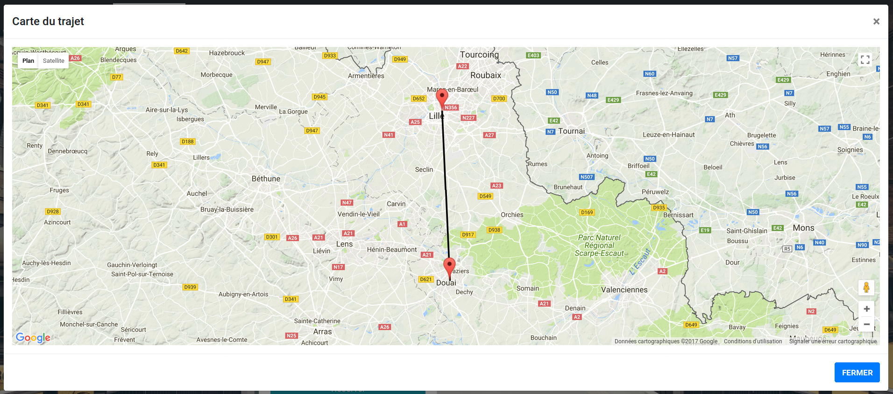

Après avoir réservé un billet via la page de résultats de recherche, il se retrouve dans votre panier.

En cliquant sur  vous afficherez une carte reprenant les gares du trajet.

En cliquant sur  vous pouvez enlever un billet de votre panier.

Vous pouvez également afficher les passagers concernés par le voyage:

En cliquant sur "carte du trajet", vous afficherez une carte reprenant les gares du trajet.

Cliquez sur le bouton "Réserver un autre billet" pour réserver un autre billet tout en convervant ceux présents dans votre panier.

Cliquez sur le bouton "payer" pour acheter tous les billets présents dans votre panier.
Lorsque vous achetez un billet, vous êtes redirigé dans la section "mes billets".
