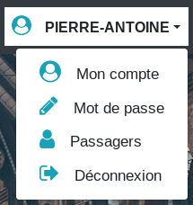
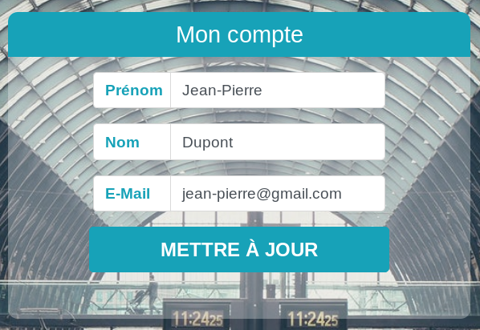

Vous pouvez effectuer ici plusieurs actions concernant votre compte :

Cliquez sur votre nom d'utilisateur pour dérouler le menu :

1. Mon compte : pour afficher et modifier les informations de votre compte
   
1. Mot de passe : pour modifier le mot de passe de votre compte
1. Passagers : pour gérer vos passagers (voir la [documentation sur les passagers](passagers.md))
   
1. Déconnexion : pour vous déconnecter et retourner à la page d'accueil
