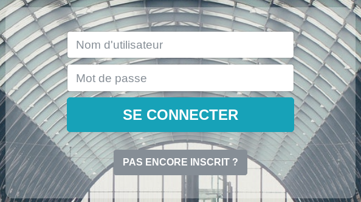

Cette page vous permez de vous connecter à votre compte. Cela implique que vous vous soyez inscrit au préalable. 

Pour vous connecter, vous devez :
1. Indiquer votre nom d'utilisateur
2. Indiquer votre mot de passe
3. Cliquer sur le bouton "se connecter"

Vous pouvez également cliquer sur le bouton "pas encore inscrit ?" si vous n'êtes pas encore inscrit ou si vous souhaitez créer un autre compte.
