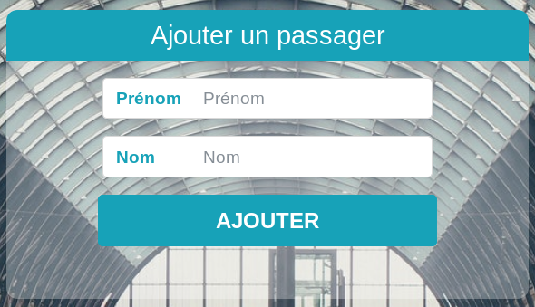
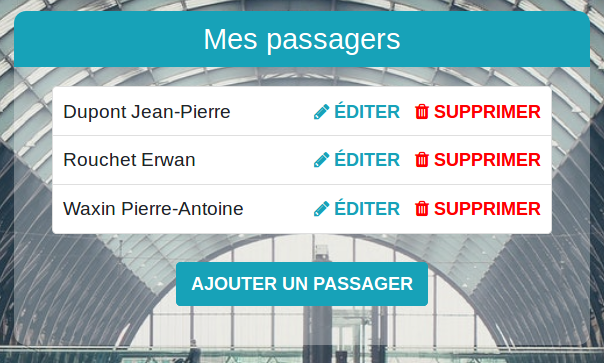
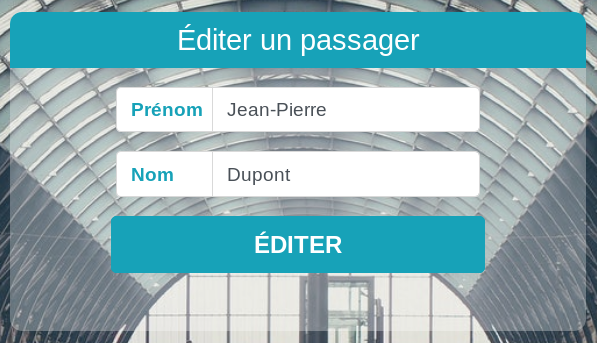

Cette page affiche la liste de vos passagers.
À la création de votre compte, un passager reprenant vos informations personnelles est automatiquement créé.

Lorsqu'il ne vous reste qu'un seul passager, vous ne pouvez pas le supprimer.

Pour ajouter un nouveau passager, cliquez sur le bouton "Ajouter un passager".

Renseignez ensuite les nom et prénom du passager puis cliquez sur le bouton "Ajouter".

En cliquant sur "Passagers" dans le menu de votre compte, vous pouvez voir la liste de vos passagers.

Vous pouvez modifier les informations d'un passager en cliquant sur le bouton "Éditer" qui lui est associé.

Vous pouvez de la même manière supprimer un passager en cliquant sur le bouton  qui lui est associé.

Si vous supprimez un passager par inadvertance, il vous suffit d'en recréer un avec les mêmes informations pour le récupérer.
