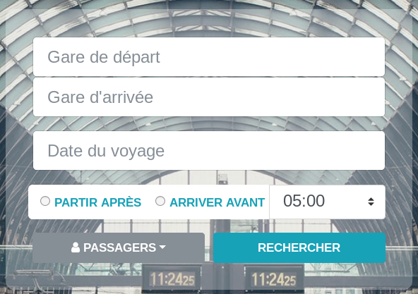
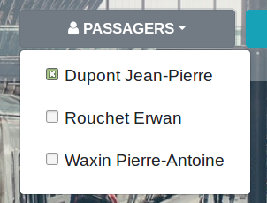

Cette page vous permet de rechercher des trajets en bus ou en train.  
Des trajets avec une correspondance (avec 3 heures d'attente maximum entre les correspondances) seront affichés si il n'existe pas de trajets directs.

Pour effectuer une recherche, vous devez :
1. Renseigner la gare de départ
2. Renseigner la gare d'arrivée  
   > Lors de la sélection d'une gare, veuillez ne pas changer le nom des gares qui vous sont proposées automatiquement. Autrement, la recherche ne sera pas effectuée.
3. Renseigner la date à laquelle vous souhaitez voyager
4. Indiquer si vous souhaitez partir avant ou après une certaine heure
5. Renseigner l'heure susmentionnée
6. Faites dérouler la liste de vos passagers en cliquant sur "passagers" puis cochez les passagers concernés par ce voyage.  
   
7. Cliquer sur le bouton "rechercher"
