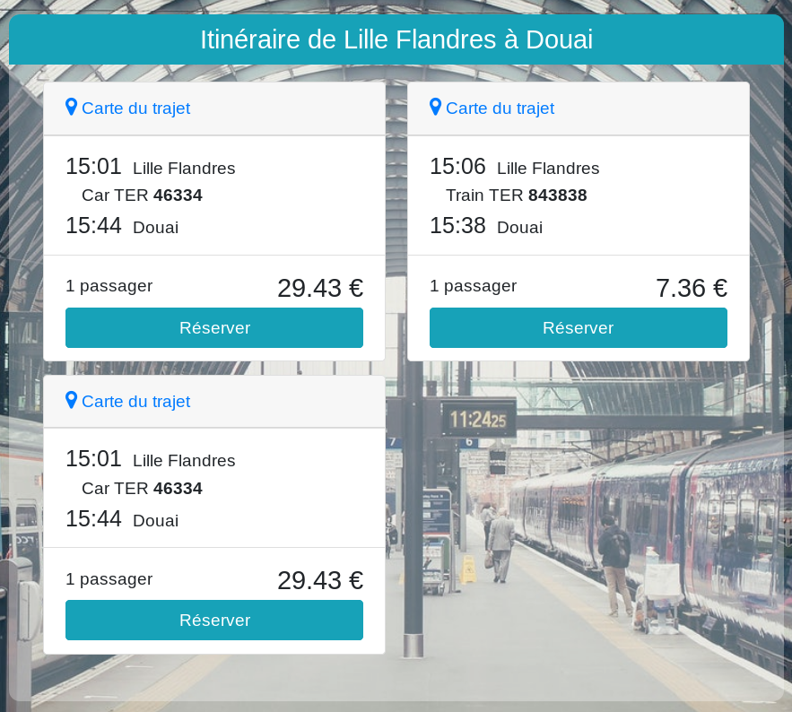
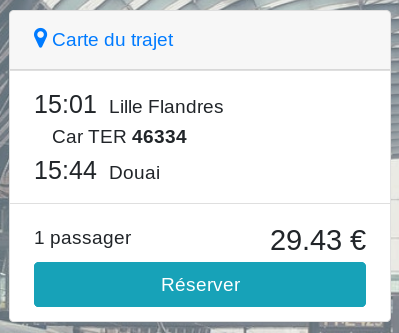
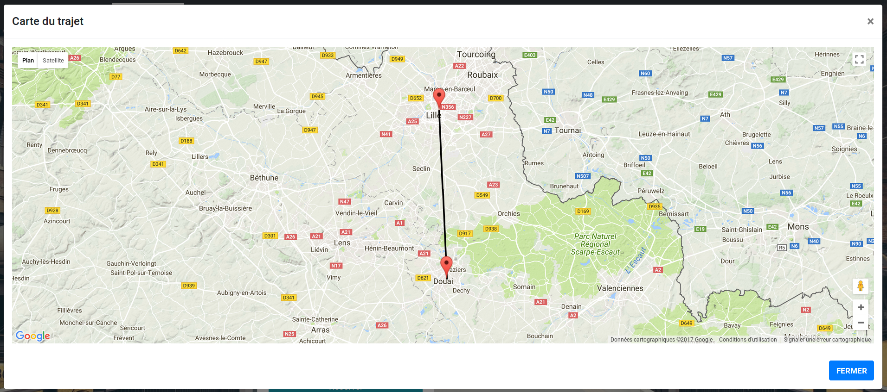

Après avoir effectué une recherche, vous serez redirigé sur cette page.
Elle liste les trajets correspondant à votre recherche, si il y en a.
Des trajets avec correspondance vous seront proposés si il n'y a pas de trajet direct.

Chaque trajet est représenté sous cette forme :

En cliquant sur "carte du trajet", vous afficherez une carte reprenant les gares du trajet.

Si vous êtes connecté, le prix du trajet est affiché.
Cliquez sur le bouton "Réserver" pour réserver un billet pour ce trajet. Celui-ci sera ajouté à votre panier.
