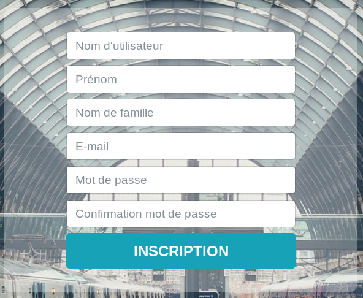

Cette page vous permet de vous inscrire. Une fois votre compte créé, vous pourrez pleinement profiter des services offerts par TchouTchouGo.

Pour vous inscrire, vous devez:
1. Indiquer un nom d'utilisateur qui vous servira à vous connecter par la suite
2. Renseigner votre prénom
3. Renseigner votre nom
4. Renseigner votre adresse mail
5. Renseigner un mot de passe qui vous sera demandé lors de vos connexions à votre compte
6. Confirmer le mot de passe précédemment entré. Si les mots de passe sont différents, votre inscription échouera.
7. Cliquer sur le bouton "inscription"

Si votre inscription a été correctement effectuée, vous serez automatiquement connecté.
